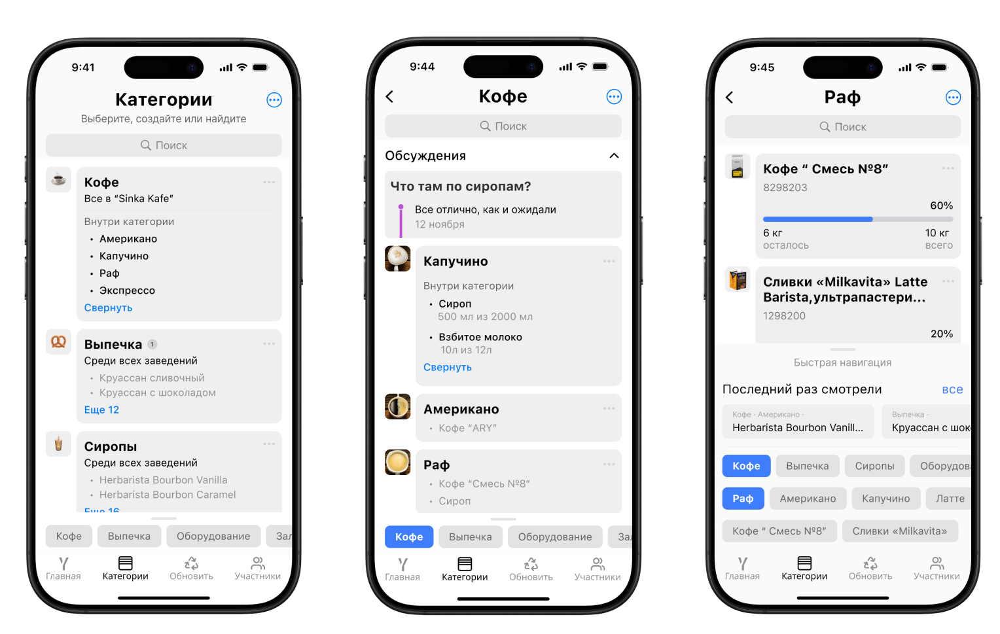

# YAGOZA

## О проекте

**YAGOZA** — это инновационное приложение, разработанное для упрощения контроля ресурсов в малом и среднем бизнесе. Приложение помогает оптимизировать процессы управления запасами, отслеживать расходы и повышать эффективность работы вашей компании.

---

### ⚠️ Важно: Проект находится на ранней стадии разработки

На данный момент приложение находится в активной фазе разработки. Некоторые функции могут быть незавершены или работать нестабильно.

---

